# Air Quality Analysis Documentation (2019–2023)
Comprehensive technical walkthrough of data engineering, cleaning, and analysis methodology

---

## Table of Contents
- [Preparation](#preparation)
  - [Metadata](#meta_data)
  - [Supporting Documentation](#supporting_documentation)
  - [Workflow](#work_flow)
- [Process](#process)
  - [Initial Setup](#initial_setup)
  - [Data Exploration (1)](#data_exploration-1)
  - [Cleaning](#cleaning)
  - [Interpolation](#interpolation)
- [Analysis](#analysis)
  - [Calculated Fields](#calculated_fields)
  - [WHO Guidelines](#who_guidelines)
  - [Data Exploration (2)](#data_exploration-2)
- [Visualization](#visualization)

---

## TLDR

- Dataset downloaded from [aqicn.org](https://aqicn.org/data-platform/covid19/) as CSV
- Research done to establish relevant sampling and external benchmarks for analysis
- Data loaded into a PostgreSQL database locally
- Python used to interact with database; Matplotlib used in Jupyter Notebook to visualize data integrity
- Fixed misplaced data and dropped unusable data
- Only cities/years with 75% complete data were used
- Rolling averages weighted on the basis of data completeness
- Statistical columns (Z-score, composite index) added for further data exploration
- Subsequent data exploration with statistical columns used to identify remaining unusable data
- Converted SQL queries to JSON file for use in web app visualization

---

# PREPARATION
## meta_data

- Data downloaded from: https://aqicn.org/data-platform/covid19/
  - Dates span 2015-2023
  - Countries: 95
  - Cities: 616
  - Variables: 24 (9 pollutants, 15 weather)

<details>
<summary>metadata from website</summary>

**The data for each major cities is based on the average (median) of several stations. The data set provides min, max, median and standard deviation for each of the air pollutant species (PM2.5, PM10, Ozone ...) as well as meteorological data (Wind, Temperature, ...).**

- All air pollutant species are converted to the US EPA standard (i.e. no raw concentrations). All dates are UTC based.
- The count column is the number of samples used for calculating the median and standard deviation.
- The city-median value is computed per day using all AQI values for available stations.

</details>

<details>
<summary>table schemas</summary>

aqi:
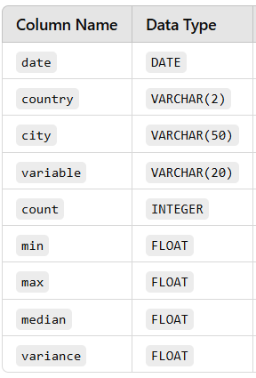

</details>

## supporting_documentation

<details>
<summary>Benchmark for minimum sampling</summary>

From [Perplexity](images/Perplexity.png):

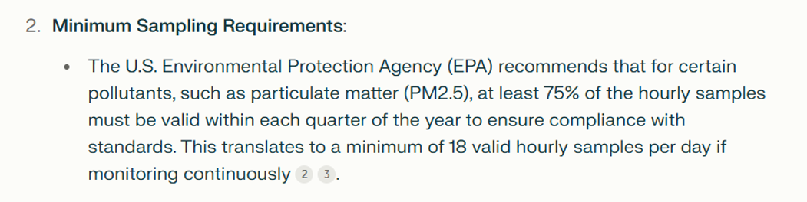

[document referenced](references/EPA_min_sampling_doc(2).pdf)

</details>

<details>
<summary>Benchmark for complete data</summary>

From [Chat GPT](images/Chat_GPT.png):

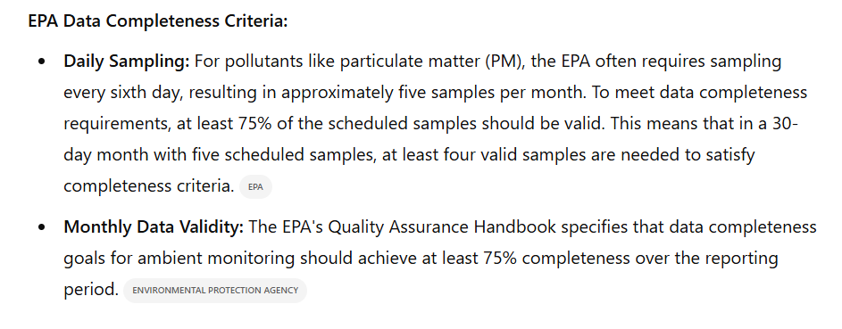

[document referenced](references/EPA_min_completeness_doc(1).pdf)

</details>

<details>
<summary>WHO pollution guidelines</summary>

From https://www.who.int/news-room/feature-stories/detail/what-are-the-who-air-quality-guidelines

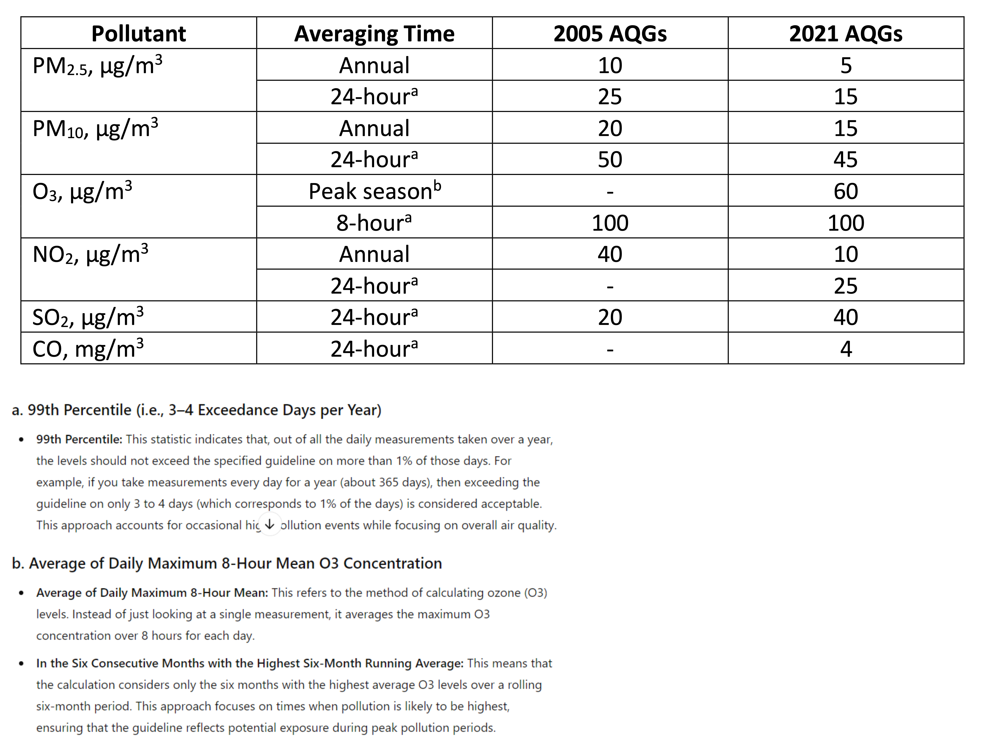

</details>

<details>
<summary>Units of measurement for variables</summary>


</details>

<details>
<summary>maximum weather measurements (from ChatGPT)</summary>

### **1. Dew Point ("dew")**
- **Maximum Value**: Around **35°C (95°F)**
- **Reason**: Dew point represents the temperature at which air becomes saturated with moisture. High values occur in very humid tropical conditions.

---

### **2. Humidity**
- **Maximum Value**: **100%**
- **Reason**: Humidity is the measure of water vapor saturation in the air, and 100% represents fully saturated air (e.g., during fog, rain, or extremely humid conditions).

---

### **3. Precipitation**
- **Maximum Value**:
  - **Daily Total**: Around **2,500 mm (98.4 inches)**
  - **Reason**: Record daily precipitation events (e.g., tropical cyclones, monsoons) have produced these totals, such as in tropical regions.
  - **Hourly Intensity**: Up to **300 mm (11.8 inches)**

---

### **4. Temperature**
- **Maximum Value**: Around **56.7°C (134°F)**
- **Reason**: The hottest recorded temperature on Earth was measured in Death Valley, USA. Slightly higher values may occur under extreme artificial or isolated conditions.

---

### **5. Wind Direction ("wd")**
- **Maximum Value**: **360 degrees**
- **Reason**: Wind direction is measured as an azimuthal angle from 0° to 360°, with 360° representing north.

---

### **6. Wind Gust**
- **Maximum Value**: Around **400 km/h (250 mph)**
- **Reason**: The strongest wind gusts ever recorded are from tornadoes or extreme cyclones. Examples include the 407 km/h gust during Cyclone Olivia (1996).

---

### **7. Wind Speed**
- **Maximum Value**: Around **300 km/h (186 mph)**
- **Reason**: Sustained wind speeds typically peak during strong tropical cyclones. Higher gusts are possible but are short-lived.

</details>

## work_flow

- Files used in repository follow this structure:

  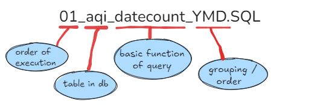

- SQL queries loaded into pandas dataframes via psycopg2 for exploration
- Seaborn and Matplotlib used to visualize explorations
- Jupyter notebooks used to document process
- HTML/CSS used for final visualizations

  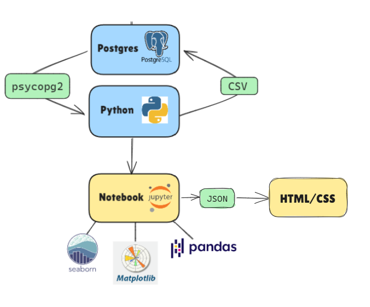

---

# PROCESS
## initial_setup

- Setup new database named PM25 in PostgreSQL with table named 'aqi': [01_aqi_CREATE_TABLE.sql](02_SQL_queries/0_table_creation/01_aqi_CREATE_TABLE.sql)

- Uploaded CSV files to database from command line using: [02_Batch_upload_CSV.py](03_python/01_portable_scripts/02_Batch_upload_CSV.py)

- 'aqi' table schema:

  

## data_exploration (1)

- Loaded initial SQL queries into pandas DF and created scatter plots and heat maps to visualize data distribution.

  SQL queries:

  [03_aqi_date_count_YM.sql](02_SQL_queries/01_data_exploration/03_aqi_date_count_YM.sql)

  [04_aqi_date_count_YMD.sql](02_SQL_queries/01_data_exploration/04_aqi_date_count_YMD.sql)

  [05_aqi_variable_count_YM.sql](02_SQL_queries/01_data_exploration/05_aqi_variable_count_YM.sql)

  [06_aqi_variable_count_YMD.sql](02_SQL_queries/01_data_exploration/06_aqi_variable_count_YMD.sql)

- Notebook: [07_aqi_data_exploration_1.ipynb](03_python/02_jupyter_notebooks/07_aqi_data_exploration_1.ipynb)

### INSIGHTS

#### ⤵️ Missing/Incomplete Data
- No data for months Q3-4 in 2014-2018 and Q1 2022
- Less relative data for Q1-2 in 2014-2018 and Q3-4 2023

  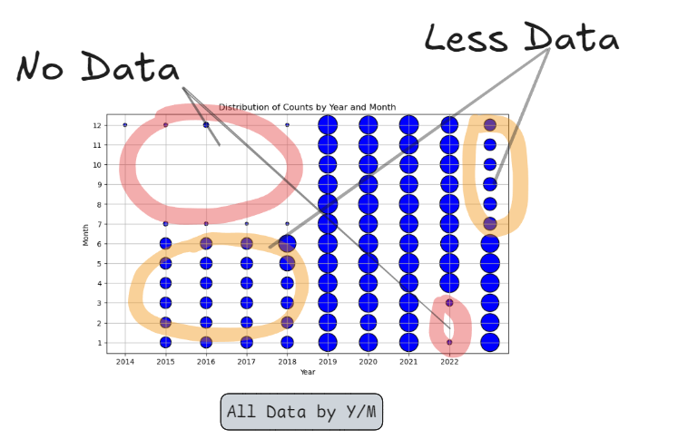

- Data becomes inconsistent after Q2-2023

  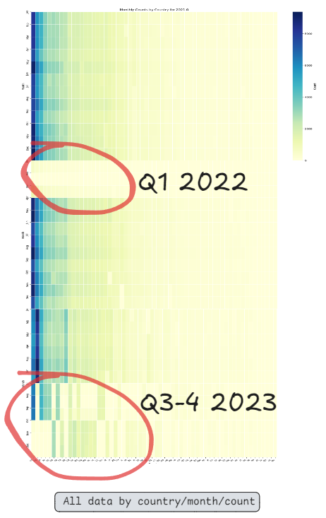

- There are smaller holes in data of 8 days or less across entire dataset

  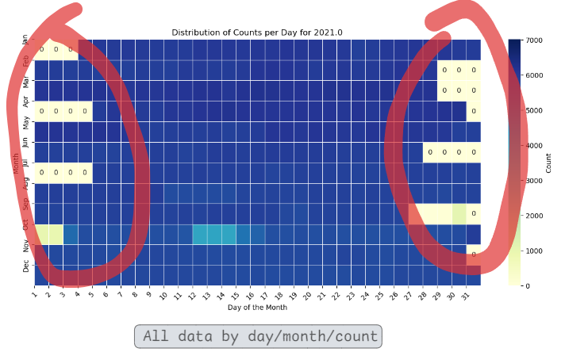

- Weather data not collected until 2019

  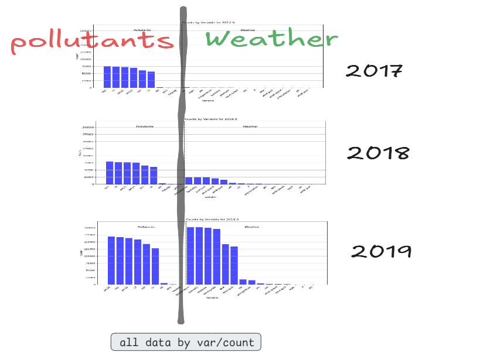

#### ⤵️ Misplaced/Unused Data
- Variables wind-speed and wind-gust appear to have two columns named for each with one set recording Q1 2020 and the other for Q2-4 2020

  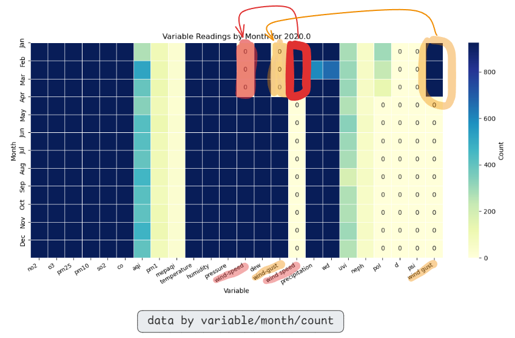

- Columns: aqi, pm1, mepaqi, wind speed, uvi, neph, pol, d, psi, wind gust have little or no data

  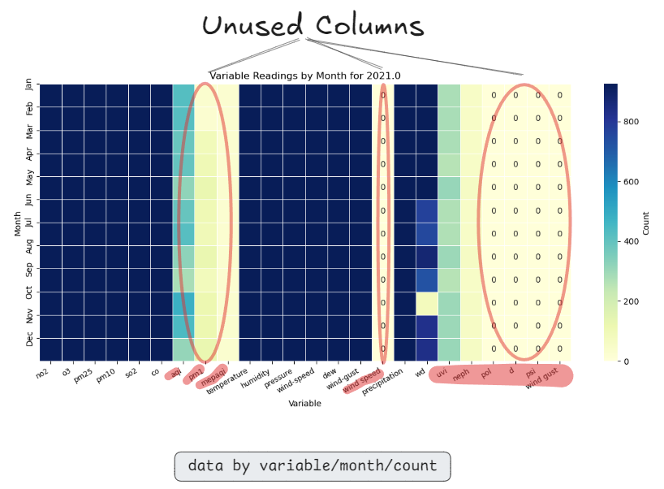

#### 🔴 ACTION

<details>
<summary>Cleaning steps</summary>

- Only use data from Q1 2019 - Q2 2023 as it represents the most complete unbroken time series
- Drop unused columns for clarity
- Interpolate data that is 8 days or less
- Missing Q1 2022 is too large to interpolate, will be marked as incomplete on final analysis
- Filter out rows where count is < 18 (see: [Benchmark for minimum sampling](#supporting_documentation))

</details>

## cleaning

- Back up table: [08_aqi_BACKUP_TABLE.sql](02_SQL_queries/02_data_cleaning/08_aqi_BACKUP_TABLE.sql)

- Find/Drop:
  - duplicate rows: [09_aqi_DELETE_DUPLICATES.sql](02_SQL_queries/02_data_cleaning/09_aqi_DELETE_DUPLICATES.sql)
  - rows that have NULL values: [10_aqi_CHECK_NULL.sql](02_SQL_queries/02_data_cleaning/10_aqi_CHECK_NULL.sql)
  - unused variable values (aqi, pm1, mepaqi, uvi, neph, pol, d, psi): [11_aqi_DELETE_UNUSED_variable.sql](02_SQL_queries/02_data_cleaning/11_aqi_DELETE_UNUSED_variable.sql)
  - rows where "count" < 18 (see: [Benchmark for minimum sampling](#supporting_documentation)): [12_aqi_DELETE_count_lessthan_18.sql](02_SQL_queries/02_data_cleaning/12_aqi_DELETE_count_lessthan_18.sql)
  - rows that have erroneous data (min = max, min = median, max = median): [13_aqi_DELETE_erroneous_data.sql](02_SQL_queries/02_data_cleaning/13_aqi_DELETE_erroneous_data.sql)

- Fix misplaced variables (wind-speed / wind-gust):
  - verify any overlapping duplicates between (wind-gust / wind gust): [14_aqi_FIND_DUPS_wind gust_wind-gust.sql](02_SQL_queries/02_data_cleaning/14_aqi_FIND_DUPS_wind%20gust_wind-gust.sql)
  - delete the overlapping data from the variable to be moved (wind gust): [15_aqi_DELETE_overlap_wind gust.sql](02_SQL_queries/02_data_cleaning/15_aqi_DELETE_overlap_wind%20gust.sql)
  - Move remaining data from wind gust -> wind-gust: [16_aqi_UPDATE_variable_wind gust.sql](02_SQL_queries/02_data_cleaning/16_aqi_UPDATE_variable_wind%20gust.sql)
  - repeat process for wind speed / wind-speed:
    [17_aqi_FIND_DUPS_wind speed_wind-speed.sql](02_SQL_queries/02_data_cleaning/17_aqi_FIND_DUPS_wind%20speed_wind-speed.sql)
    [18_aqi_DELETE_overlap_wind speed.sql](02_SQL_queries/02_data_cleaning/18_aqi_DELETE_overlap_wind%20speed.sql)
    [19_aqi_UPDATE_variable_wind speed.sql](02_SQL_queries/02_data_cleaning/19_aqi_UPDATE_variable_wind%20speed.sql)

- Find cities that have at least 75% data for the year continuously for years 2019-2023 (see: [Benchmark for complete data](#supporting_documentation))
  - Because of the Q1 2022 missing data across all cities the check for continuous data will be split up between 2019-Q4 2021 and Q2 2022-Q2 2023:
    [20_aqi_2019-2021_VIEW.sql](02_SQL_queries/02_data_cleaning/20_aqi_2019-2021_VIEW.sql)
    [21_aqi_2022-2023_VIEW.sql](02_SQL_queries/02_data_cleaning/21_aqi_2022-2023_VIEW.sql)
  - this query that finds data for all 12 months and at least 270 days is applied to 2019-2021 VIEW and a CSV file is generated to filter out final table for cities with complete data:
    [22_aqi_2019-2021_cities_with_consecutive_complete_data.sql](02_SQL_queries/02_data_cleaning/22_aqi_2019-2021_cities_with_consecutive_complete_data.sql)
  - Query is modified to apply to 2022-2023:
    [23_aqi_2022-2023_cities_with_consecutive_complete_data.sql](02_SQL_queries/02_data_cleaning/23_aqi_2022-2023_cities_with_consecutive_complete_data.sql)

- Two tables are created from the CSV output of the above queries and their intersection is used to create a new table of the cleaned data from 2019-2023:
  [24_cities_2019-22__2022-23_CREATE_TABLE.sql](02_SQL_queries/0_table_creation/24_cities_2019-22__2022-23_CREATE_TABLE.sql)
  [25_aqi_cleaned_CREATE_TABLE.sql](02_SQL_queries/0_table_creation/25_aqi_cleaned_CREATE_TABLE.sql)

## interpolation

- Loaded contents of aqi_cleaned into pandas DF and used linear interpolation method to fill in only 8 days or less worth of missing data:
  [26_aqi_cleaned_ALL.sql](02_SQL_queries/03_data_transformation/26_aqi_cleaned_ALL.sql)

- Notebook: [25_aqi_2019-23_interpolate.ipynb](03_python/02_jupyter_notebooks/25_aqi_2019-23_interpolate.ipynb)

- Data is loaded back into aqi_cleaned after being backed up:
  [27_aqi_cleaned_BACKUP_TABLE.sql](02_SQL_queries/03_data_transformation/27_aqi_cleaned_BACKUP_TABLE.sql)

---

# ANALYSIS
## calculated_fields

- Standard deviation column (SD) was added for easier calculations for Z-score:
  [29_aqi_cleaned_sd_MATERIALIZED_VIEW.sql](02_SQL_queries/03_data_transformation/29_aqi_cleaned_sd_MATERIALIZED_VIEW.sql)

- A completeness score was calculated as percentage of complete data for each variable by month over all years. This will be used to weight the 30 day rolling average for accuracy:
  [30_aqi_cleaned_weights_MATERIALIZED_VIEW.sql](02_SQL_queries/03_data_transformation/30_aqi_cleaned_weights_MATERIALIZED_VIEW.sql)

- A 30 day weighted rolling average was applied to all variables:

  

  This is the sum of (ε) the reading for the variable (x) multiplied by the completeness score (w) divided by the sum of the completeness score for 30 days (i):
  [31_aqi_sd_ra_MATERIALIZED_VIEW.sql](02_SQL_queries/03_data_transformation/31_aqi_sd_ra_MATERIALIZED_VIEW.sql)

- Z scores were calculated for normalization by city and the entire dataset
- Two scores were made for overall analysis and city specific to avoid losing finer grained data to averaging

  

  This is the reading for the variable (x) minus the average of the 30 day rolling average (μ) divided by the standard deviation of μ (σ):
  [32_aqi_sd_ra_z_MATERIALIZED_VIEW.sql](02_SQL_queries/03_data_transformation/32_aqi_sd_ra_z_MATERIALIZED_VIEW.sql)

## WHO_guidelines

- A table detailing what the [WHO pollution guidelines](#supporting_documentation) are for each pollutant was made to join to main table so days that exceed standards can be flagged and quantified:
  [33_who_guidlines_CREATE_TABLE.sql](02_SQL_queries/0_table_creation/33_who_guidlines_CREATE_TABLE.sql)

- The table was then joined to the main table to tally days that exceeded the WHO's guidelines:
  [34_aqi_sd_ra_z_who_MATERIALIZED_VIEW.sql](02_SQL_queries/03_data_transformation/34_aqi_sd_ra_z_who_MATERIALIZED_VIEW.sql)

- From that table a magnitude score was calculated to scale how "bad" the pollution is for a given data point. Both frequency and amplitude of occurrence are taken into consideration as equally important (That is the amount the pollutant exceeds is as important as how many days it exceeds). This is intended to take into account that 10 days where the pollution exceeds the limit by say 1 or 2 points is not as bad as one day where it is 100 points in exceedance. The formula for this is as follows:

  

  [35_aqi_sd_ra_z_who_magnitude_MATERIALIZED_VIEW.sql](02_SQL_queries/03_data_transformation/35_aqi_sd_ra_z_who_magnitude_MATERIALIZED_VIEW.sql)

## data_exploration (2)

- A final look at the data to ensure its integrity. Because we have Z scores and a magnitude score we can look at outliers to see if there is any remaining data that may have been incorrectly gathered before we create the queries for our final analysis.

- For simplicity two final tables are created and unused MATERIALIZED VIEWS\VIEWS\TABLES are dropped:
  [37_final_tables_DROP_unused.sql](02_SQL_queries/03_data_transformation/37_final_tables_DROP_unused.sql)

- A final View of the full table joined with the magnitude table is created:
  [38_final_tables_combined_MATERIALIZED_VIEW.sql](02_SQL_queries/03_data_transformation/38_final_tables_combined_MATERIALIZED_VIEW.sql)

- The full contents of that table is loaded into a DF and the 30 day rolling average, Z scores (city & all), and magnitude scores were put into a KDE chart (KDE was chosen over histogram for readability) with each pollutant variable as a facet:
  [39_aqi_full_report_find_outliers_pollutants.sql](02_SQL_queries/01_data_exploration/39_aqi_full_report_find_outliers_pollutants.sql)

- Notebook: [40_aqi_full_report_data_exploration_2.ipynb](03_python/02_jupyter_notebooks/40_aqi_full_report_data_exploration_2.ipynb)

### INSIGHTS
#### ⤵️ Outliers
- Chart shows that there are sizable discrepancies in the clustering of data for the Z-score and magnitude. Data will be looked at values above:
  - 140 in the 30_day_rolling_avg
  - 6 in z_score_all
  - 4 in z_score_city
  - 150 in magnitude_score

  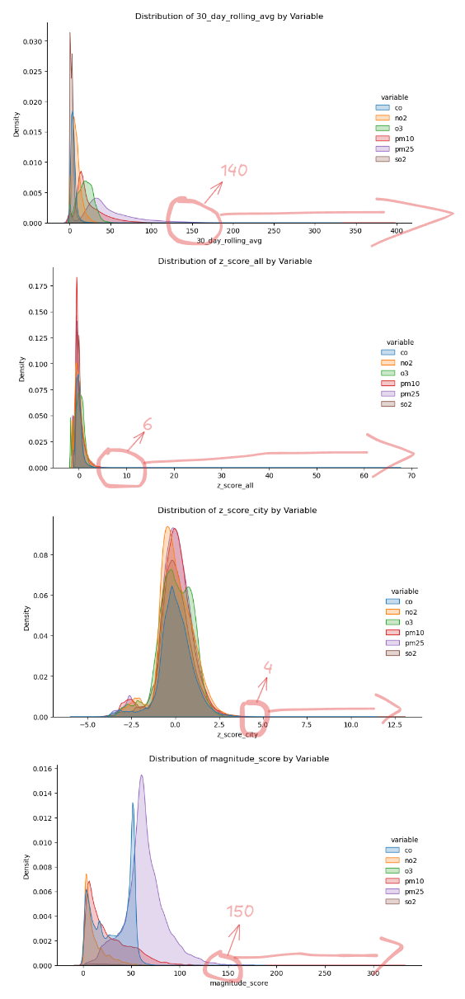

- In an effort not to flag valid outliers a scatterplot was made between the magnitude score and Z_scores to further identify abnormalities:

  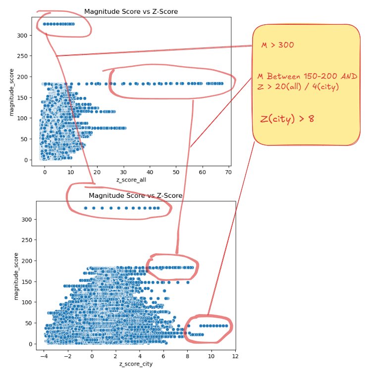

- For magnitude_score > 300, 31 rows were found. A high reading of 879 was recorded and repeated from interpolation as the likely cause of the high magnitude score. Further research indicated that there were several forest and urban fires that could validate such a high reading. Only the subsequent interpolated rows will be dropped (San Luis Potosi PM10 for 2022-08-21 - 28):

  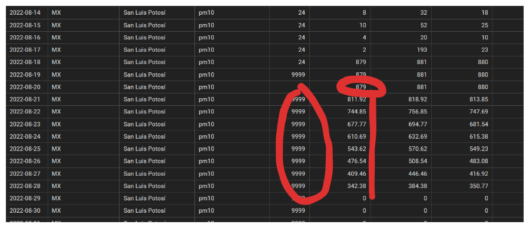

- For magnitude_score between 160-200 and z_score > 20(all)/4(city) no discernable discrepancies could be identified

- The same analysis was done for weather variables and found that z_scores above 2.5 should be investigated as well

  > **Note:** since magnitude_score is irrelevant to the weather variables and 'pressure' has a different scaling only z_scores were used to identify outliers

  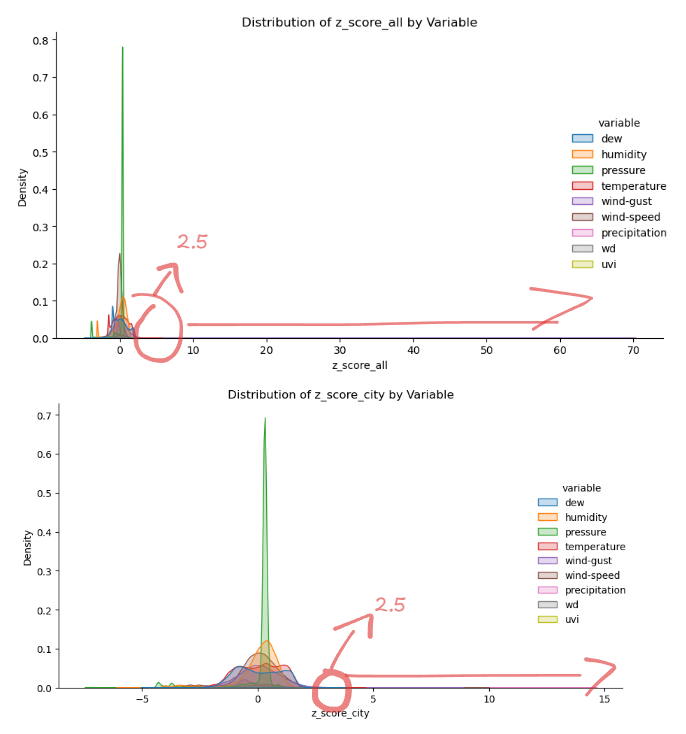

- For weather variables with z_score > 2.5 over 10k rows were returned. These were matched against known maximum recordings (see: [maximum weather measurements](#supporting_documentation)) and subsequently dropped:
  [42_aqi_full_report_DELETE_weather_outliers.sql](02_SQL_queries/02_data_cleaning/42_aqi_full_report_DELETE_weather_outliers.sql)

---

# VISUALIZATION

- Notebook: [43_aqi_full_report_xtract_json_for_viz.ipynb](03_python/02_jupyter_notebooks/43_aqi_full_report_xtract_json_for_viz.ipynb)

---

## VISUALIZATION

Python scripts in Jupyter notebook extract all aggregated data into a static JSON file for the interactive web app visualization.

📓 [JSON Export Notebook](./03_python/02_jupyter_notebooks/43_aqi_full_report_xtract_json_for_viz.ipynb)

The script aggregates country, city, region, and world-level outputs into `aqi_data.json`, committed to the `docs/` folder and served statically via GitHub Pages. Region and world rollups are computed in Python from the query outputs below — no additional SQL is used for those aggregations.

### Queries Used for Visualization

<details>
<summary><strong>View SQL:</strong> Countries and Years</summary>

Returns distinct country/year combinations for PM2.5. Used to populate the `meta.countries` and `meta.years` fields in `aqi_data.json`.

```sql
SELECT DISTINCT country, EXTRACT(YEAR FROM date)::int AS year
FROM aqi_full_report
WHERE variable = 'pm25'
ORDER BY country, year
```

</details>

<details>
<summary><strong>View SQL:</strong> Country-Level Pollutant Exceedance Overview</summary>

Average exceedance rate per pollutant per year at the country level. Note: months where exceedance was zero are stored as null in source data and are excluded from averages — functionally equivalent given exceedance rates are well above zero across this dataset.

```sql
SELECT
    country,
    EXTRACT(YEAR FROM date)::int AS year,
    variable,
    AVG(monthly_percent_exceeded)::float AS avg_pct
FROM aqi_full_report
WHERE variable = ANY(%s)
  AND monthly_percent_exceeded IS NOT NULL
GROUP BY country, year, variable
ORDER BY country, year, variable
```

</details>

<details>
<summary><strong>View SQL:</strong> City-Level Pollutant Exceedance Overview</summary>

Average exceedance rate per pollutant per year at the city level. O3 excluded — `over_who_limit` flag was not computed for O3 in source data.

```sql
SELECT
    country,
    city,
    EXTRACT(YEAR FROM date)::int AS year,
    variable,
    AVG(monthly_percent_exceeded)::float AS avg_pct
FROM aqi_full_report
WHERE variable = ANY(%s)
  AND monthly_percent_exceeded IS NOT NULL
  AND over_who_limit IS NOT NULL
GROUP BY country, city, year, variable
ORDER BY country, city, year, variable
```

</details>

<details>
<summary><strong>View SQL:</strong> Country-Level Monthly PM2.5 Time Series</summary>

Monthly PM2.5 30-day rolling average by country. Q1 2022 forced to null in Python after fetch — completeness below 75% EPA threshold.

```sql
SELECT
    country,
    EXTRACT(YEAR FROM date)::int  AS year,
    EXTRACT(MONTH FROM date)::int AS month,
    AVG("30_day_rolling_avg")::float AS avg_rolling
FROM aqi_full_report
WHERE variable = 'pm25'
  AND "30_day_rolling_avg" IS NOT NULL
  AND "30_day_rolling_avg" > 0
GROUP BY country, year, month
ORDER BY country, year, month
```

</details>

<details>
<summary><strong>View SQL:</strong> Country-Level Annual PM2.5 Summary</summary>

Annual PM2.5 average, magnitude score, and percent of days exceeding WHO limit by country. Used to populate left-panel summary cards.

```sql
SELECT
    country,
    EXTRACT(YEAR FROM date)::int AS year,
    AVG("30_day_rolling_avg")::float    AS annual_avg,
    AVG(magnitude_score)::float          AS avg_magnitude,
    AVG(CASE WHEN over_who_limit = 1
             THEN 1.0 ELSE 0.0 END)::float AS pct_days_exceeded
FROM aqi_full_report
WHERE variable = 'pm25'
  AND "30_day_rolling_avg" IS NOT NULL
  AND "30_day_rolling_avg" > 0
GROUP BY country, year
ORDER BY country, year
```

</details>

<details>
<summary><strong>View SQL:</strong> City-Level Annual PM2.5 Summary</summary>

Annual PM2.5 average and magnitude score by city. Used to populate city-level summary cards when a city is selected.

```sql
SELECT
    country,
    city,
    EXTRACT(YEAR FROM date)::int AS year,
    AVG("30_day_rolling_avg")::float AS annual_avg,
    AVG(magnitude_score)::float      AS avg_magnitude
FROM aqi_full_report
WHERE variable = 'pm25'
  AND "30_day_rolling_avg" IS NOT NULL
  AND "30_day_rolling_avg" > 0
GROUP BY country, city, year
ORDER BY country, city, year
```

</details>

<details>
<summary><strong>View SQL:</strong> City-Level Monthly PM2.5 Time Series</summary>

Monthly PM2.5 30-day rolling average by city. Q1 2022 forced to null in Python after fetch — same completeness rule as country-level.

```sql
SELECT
    country,
    city,
    EXTRACT(YEAR FROM date)::int  AS year,
    EXTRACT(MONTH FROM date)::int AS month,
    AVG("30_day_rolling_avg")::float AS avg_rolling
FROM aqi_full_report
WHERE variable = 'pm25'
  AND "30_day_rolling_avg" IS NOT NULL
  AND "30_day_rolling_avg" > 0
GROUP BY country, city, year, month
ORDER BY country, city, year, month
```

</details>

---

📊 For final visualizations and analysis results, see the project [README](./README.md).
